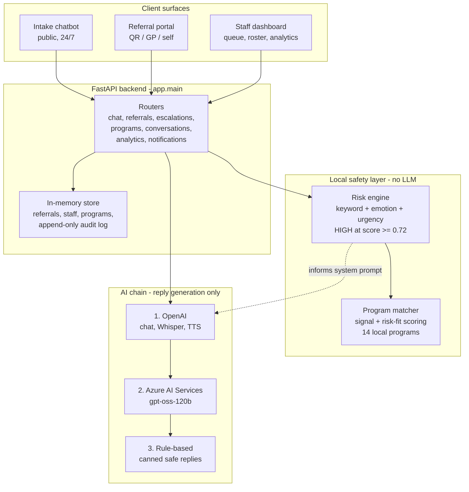

# PathFinder — Architecture

PathFinder has three parts: a set of **client surfaces**, a **FastAPI backend**, and two clearly separated intelligence layers — a **local, rule-based safety layer** and an **external AI chain** used only for generating conversational replies.

The single most important design decision is this separation: **risk scoring and escalation never depend on an LLM.** If every AI provider is unreachable, the risk engine, the program matcher, and the multi-layer escalation protocol all still run.

## Diagram

## Request flow

**Client surfaces** (`frontend/`) are a Vite/React app served on `http://localhost:5173`. There are three entry points: a public intake chatbot, a professional referral portal with source tagging, and a staff dashboard. All three talk to the same backend over HTTP; CORS is restricted to the local dev origins in `app.main`.

**FastAPI backend** (`backend/app/`) mounts seven routers from `app.main`: `chat`, `referrals`, `escalations`, `programs`, `conversations`, `analytics`, and `notifications`. `app.main` also exposes `/api/health`, `/api/transcribe`, and `/api/tts` directly. State lives in an in-memory store (`store.py`) seeded with 14 programs, 5 staff, 5 volunteers, and 25 referrals — there is no external database in the prototype. The audit log is append-only by design.

## The two intelligence layers

**Local safety layer.** `risk_engine.py` scores every inbound message in pure Python — keyword lists (`HIGH_RISK_KEYWORDS`, `MEDIUM_RISK_KEYWORDS`), an emotion detector across six emotions, urgency markers, and absolutist/farewell language markers. A hard rule enforces the "err on the side of alarm" principle: **any single high-risk keyword forces the score to at least 0.72**, which is the HIGH threshold. `program_matcher.py` then scores the 14 local programs against the message signals and the assessed risk level to suggest a service. Neither of these calls an LLM, so they cannot be taken offline by an API outage.

**AI chain.** `azure_openai.py` generates the chatbot's conversational replies with a three-step fallback: **OpenAI first** (the default, for more empathetic context-aware replies), **Azure AI Services second** (`gpt-oss-120b`), and a **rule-based responder last** if neither provider is available. Voice transcription and text-to-speech (`/api/transcribe`, `/api/tts`) run on OpenAI Whisper and OpenAI TTS. The locally-computed risk assessment is fed into the model's system prompt as context — the model shapes wording, but it never makes the risk decision.

## Escalation

When the risk engine returns HIGH, the multi-layer escalation protocol activates (tracked by the `escalations` router and the `EscalationLog` schema):

- **Layer 1 (0s):** crisis resources displayed to the person (000, Lifeline 13 11 14, NSW MHL, 13YARN).
- **Layer 2 (0s):** email + push notification to on-call staff and the CEO.
- **Layer 3 (5m):** if unacknowledged, re-alert all staff and escalate urgency.
- **Layer 4 (15m):** if still unacknowledged, SMS the CEO and log the event as a SYSTEM FAILURE requiring post-incident review.
- **Layer 5 (exit):** on conversation end, display exit resources and schedule follow-up.

Each layer activates if the previous one is not acknowledged — a failed notification advances escalation rather than silently dropping it.

## Data and privacy

The store keeps minimal PII (first name only), no Medicare numbers, and no full clinical records. PathFinder is explicitly **not** an electronic health record — it is a triage and routing tool. The audit log is immutable (append-only) so escalations can be reviewed after the fact.

## Status

Prototype, built for the LMNSPN NGM Group Hackathon (May 2026). Safety-critical deployment would require clinical oversight, legal review, a persistent datastore, and regulatory compliance work beyond the current in-memory prototype.
